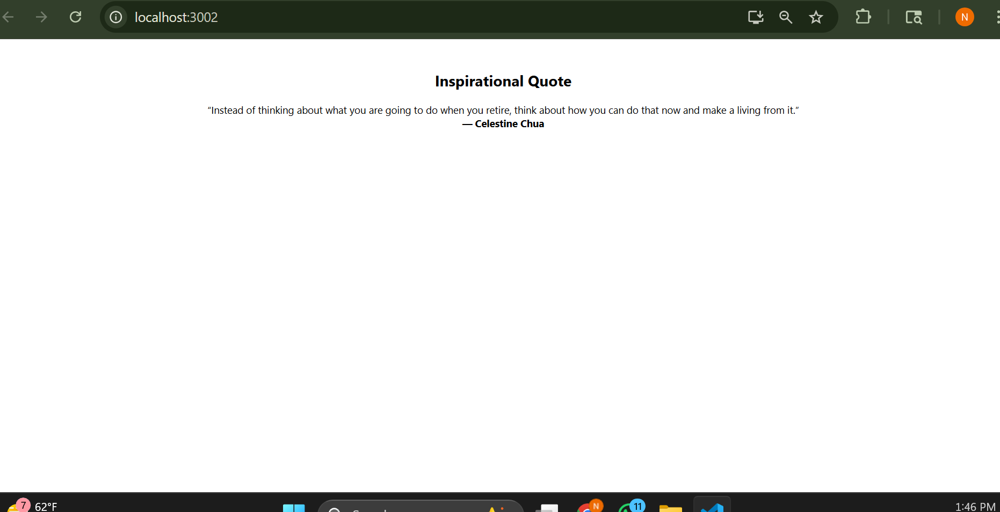

# 📝 Random Quote Generator

A simple and clean React app that fetches and displays a random inspirational quote from the [ZenQuotes API](https://zenquotes.io/).

---

## Features

- Fetches a random quote on page load
- Displays quote and author
- Loading message shown while fetching


---

## Screenshot



---

## Tech Stack

- React.js
- useEffect & useState Hooks
- Fetch API
- JSX & Inline Styling

---

##  Installation

To run this project locally:

```bash
git clone https://github.com/tnikhilchowdary/random-quote-generator.git
cd random-quote-generator
npm install
npm start
